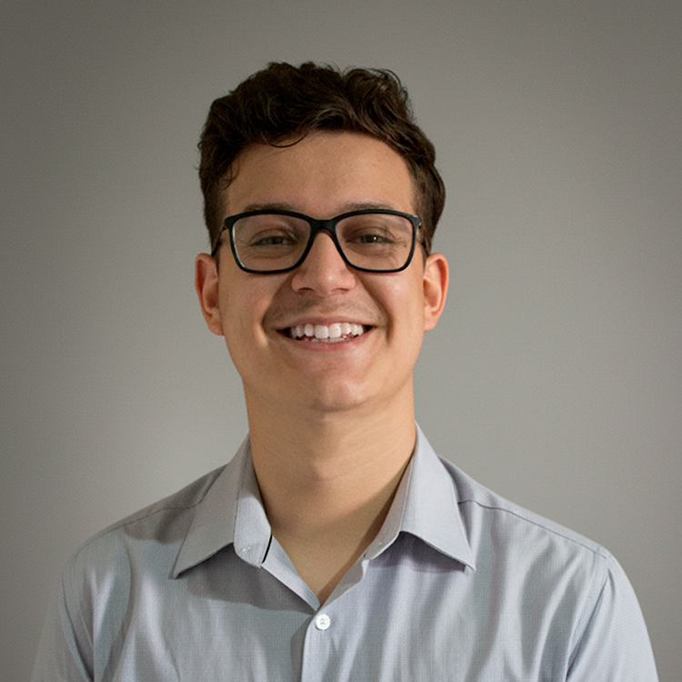

---
hide:
  - navigation
  - toc
---

  

  <h1 id="name" align="center"><strong>Esdras Battosti</strong></h1>
  
  <h2 align="center">
    <strong>
    PhD candidate in Electrical Engineering at <a href="https://utfpr.edu.br">UTFPR</a>
    & Researcher in Control Systems
    </strong>
  </h2>
  
  

    <a class="md-button md-button--primary" href="https://orcid.org/0000-0002-9288-6376">
      
        <svg xmlns="http://www.w3.org/2000/svg" viewBox="0 0 24 24">
          <path
            d="M12 0C5.372 0 0 5.372 0 12s5.372 12 12 12 12-5.372 12-12S18.628 0 12 0M7.369 4.378c.525 0 .947.431.947.947s-.422.947-.947.947a.95.95 0 0 1-.947-.947c0-.525.422-.947.947-.947m-.722 3.038h1.444v10.041H6.647zm3.562 0h3.9c3.712 0 5.344 2.653 5.344 5.025 0 2.578-2.016 5.025-5.325 5.025h-3.919zm1.444 1.303v7.444h2.297c3.272 0 4.022-2.484 4.022-3.722 0-2.016-1.284-3.722-4.097-3.722z">
          </path>
        </svg>
      
      ORCID
    </a>
    <a class="md-button md-button--primary" href="https://www.researchgate.net/profile/Esdras-Battosti-Da-Silva">
      
        <svg xmlns="http://www.w3.org/2000/svg" viewBox="0 0 448 512">
          <!--!Font Awesome Free v7.2.0 by @fontawesome - https://fontawesome.com License - https://fontawesome.com/license/free Copyright 2026 Fonticons, Inc.-->
          <path d="M0 32l0 448 448 0 0-448-448 0zM262.2 366.4c-6.6 3-33.2 6-50-14.2-9.2-10.6-25.3-33.3-42.2-63.6-8.9 0-14.7 0-21.4-.6l0 46.4c0 23.5 6 21.2 25.8 23.9l0 8.1c-6.9-.3-23.1-.8-35.6-.8-13.1 0-26.1 .6-33.6 .8l0-8.1c15.5-2.9 22-1.3 22-23.9l0-109.4c0-22.6-6.4-21-22-23.9l0-8.1c25.8 1 53.1-.6 70.9-.6 31.7 0 55.9 14.4 55.9 45.6 0 21.1-16.7 42.2-39.2 47.5 13.6 24.2 30 45.6 42.2 58.9 7.2 7.8 17.2 14.7 27.2 14.7l0 7.3zm22.9-135c-23.3 0-32.2-15.7-32.2-32.2l0-32.2c0-12.2 8.8-30.4 34-30.4s30.4 17.9 30.4 17.9l-10.7 7.2s-5.5-12.5-19.7-12.5c-7.9 0-19.7 7.3-19.7 19.7l0 26.8c0 13.4 6.6 23.3 17.9 23.3 14.1 0 21.5-10.9 21.5-26.8l-17.9 0 0-10.7 30.4 0c0 20.5 4.7 49.9-34 49.9zM168.6 276.1c-9.4 0-13.6-.3-20-.8l0-69.7c6.4-.6 15-.6 22.5-.6 23.3 0 37.2 12.2 37.2 34.5 0 21.9-15 36.6-39.7 36.6z"/>
        </svg>
      
      ResearchGate
    </a>
    <a class="md-button md-button--primary" href="https://scholar.google.com/citations?user=V2izweEAAAAJ&hl=en">
      
        <svg role="img" viewBox="0 0 24 24" xmlns="http://www.w3.org/2000/svg"><title>Google Scholar</title><path d="M5.242 13.769L0 9.5 12 0l12 9.5-5.242 4.269C17.548 11.249 14.978 9.5 12 9.5c-2.977 0-5.548 1.748-6.758 4.269zM12 10a7 7 0 1 0 0 14 7 7 0 0 0 0-14z"/>
        </svg>
      
      Scholar
    </a>
    <a class="md-button md-button--primary" href="https://lattes.cnpq.br/5361064829624642">
      
        <svg xmlns="http://www.w3.org/2000/svg" viewBox="0 0 24 24">
          <path
            d="M13 9h5.5L13 3.5zM6 2h8l6 6v12a2 2 0 0 1-2 2H6a2 2 0 0 1-2-2V4c0-1.11.89-2 2-2m9 16v-2H6v2zm3-4v-2H6v2z">
          </path>
        </svg>
      
      Lattes
    </a>
    <a class="md-button md-button--primary" href="#contact">
      
        <svg xmlns="http://www.w3.org/2000/svg" viewBox="0 0 512 512">
          <!--! Font Awesome Free 7.0.0 by @fontawesome - https://fontawesome.com License - https://fontawesome.com/license/free (Icons: CC BY 4.0, Fonts: SIL OFL 1.1, Code: MIT License) Copyright 2025 Fonticons, Inc.-->
          <path
            d="M96 0C60.7 0 32 28.7 32 64v384c0 35.3 28.7 64 64 64h288c35.3 0 64-28.7 64-64V64c0-35.3-28.7-64-64-64zm112 288h64c44.2 0 80 35.8 80 80 0 8.8-7.2 16-16 16H144c-8.8 0-16-7.2-16-16 0-44.2 35.8-80 80-80m-24-96a56 56 0 1 1 112 0 56 56 0 1 1-112 0M512 80c0-8.8-7.2-16-16-16s-16 7.2-16 16v64c0 8.8 7.2 16 16 16s16-7.2 16-16zm0 128c0-8.8-7.2-16-16-16s-16 7.2-16 16v64c0 8.8 7.2 16 16 16s16-7.2 16-16zm-16 112c-8.8 0-16 7.2-16 16v64c0 8.8 7.2 16 16 16s16-7.2 16-16v-64c0-8.8-7.2-16-16-16">
          </path>
        </svg>
      
      Get in touch
    </a>
  

<h2 align="center"><strong>Bio</strong></h2>

**English:**

  Bachelor of Science in Control and Automation Engineering from the Federal University of Technology - Paraná (UTFPR); Master of Science in Electrical Engineering and Ph.D. candidate in Electrical Engineering at the same institution. I'm working as a researcher in the field of control systems, with a focus on LPV (Linear Parameter-Varying) systems and artificial intelligence techniques, particularly machine learning. I have conducted research in undergraduate research projects focused on the optimization of industrial problems and the estimation of parameters in LPV systems using neural networks, resulting in publications in conferences and journals. I have practical experience with Python and MATLAB, including the development of neural networks, machine learning models, algorithmic simulations, and process automation.

**Portuguese:**

  Bacharel em Engenharia de Controle e Automação pela Universidade Tecnológica Federal do Paraná (UTFPR) - câmpus Cornélio Procópio, mestre em Engenharia Elétrica e doutorando em Engenharia Elétrica pela mesma instituição. Atua como pesquisador nas áreas de sistemas de controle, com foco em sistemas LPV (<i>Linear Parameter-Varying</i>) e em técnicas de inteligência artificial, especialmente aprendizado de máquina. Desenvolvi pesquisas em iniciações científicas voltadas à otimização de problemas industriais e à estimação de parâmetros em sistemas LPV com redes neurais, resultando em publicações em conferências e em journal. Possuo experiência prática com Python e MATLAB, incluindo desenvolvimento de redes neurais, modelos de aprendizagem de máquina, simulações algorítmicas e automação de processos.

---

<h2 align="center" id="contact"><strong>Contact</strong></h2>

  - :octicons-location-16: Cornélio Procópio, Paraná, Brazil

    ---

    [:octicons-mail-16: esdras.2019@alunos.utfpr.edu.br](mailto:esdras.2019@alunos.utfpr.edu.br) 
    [:material-linkedin: /esdrasbattosti](https://www.linkedin.com/in/esdrasbattosti/) 

